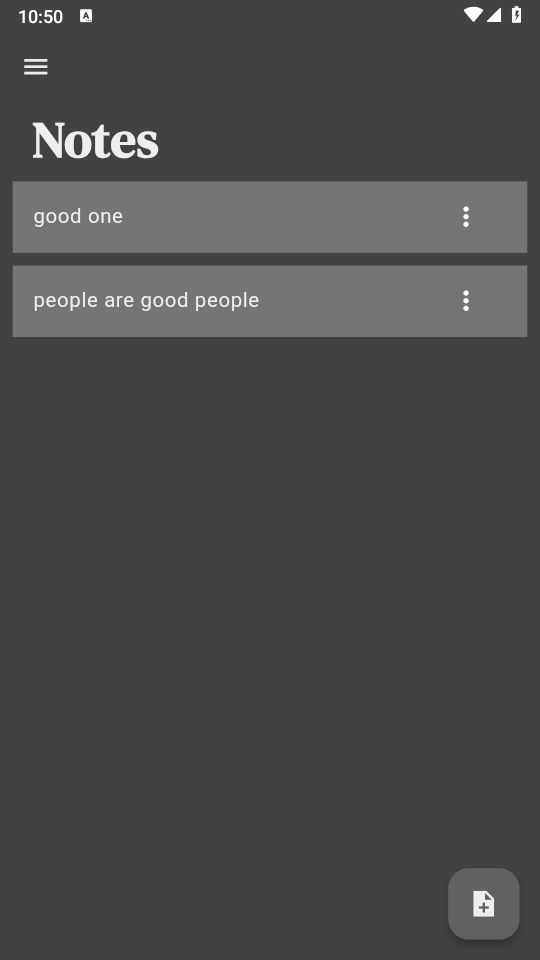

# Notes App

A Flutter project for creating and managing notes.

## Description

This Notes App is a simple yet powerful application built with Flutter. It allows users to create, read, update, and delete notes, providing a seamless note-taking experience across different platforms.

## Features

- Create new notes
- View existing notes
- Update notes
- Delete notes
- Cross-platform support (Android, iOS, Web, Windows, macOS, Linux)
- Local database management using Isar.

## Getting Started

To get started with this project:

1. Ensure you have Flutter installed on your machine.
2. Clone this repository
   [here](https://github.com/Chinoko/notes_app)
3. Open the project in your IDE
4. Run this command to install dependencies.

   flutter pub get

5. Type this command to start the application on your preferred device or emulator.

   flutter run

## Project Structure

- `lib/main.dart`: The entry point of the application.
- `lib/pages/notes_page.dart`: The main page for displaying notes.
- `lib/models/note.dart`: The data model for notes.
- `lib/models/note_database.dart`: Handles database operations for notes using Isar.

## Dependencies

- flutter
- isar: For local database management
- path_provider: To get the application documents directory

## Contributing

Contributions are welcome! Please feel free to submit a Pull Request.

## License

This project is open source and available under the [MIT License](LICENSE).
